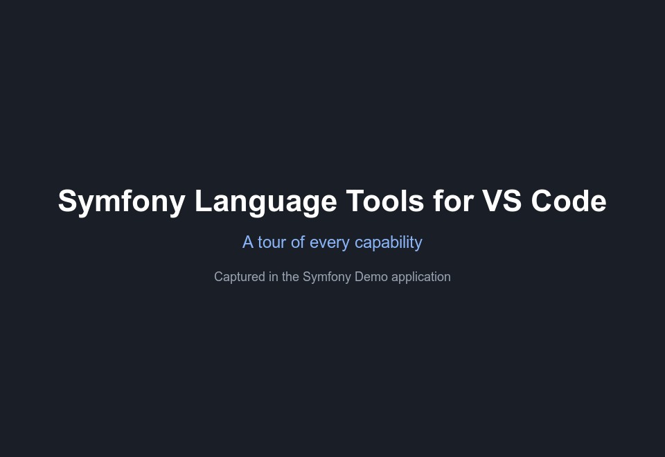
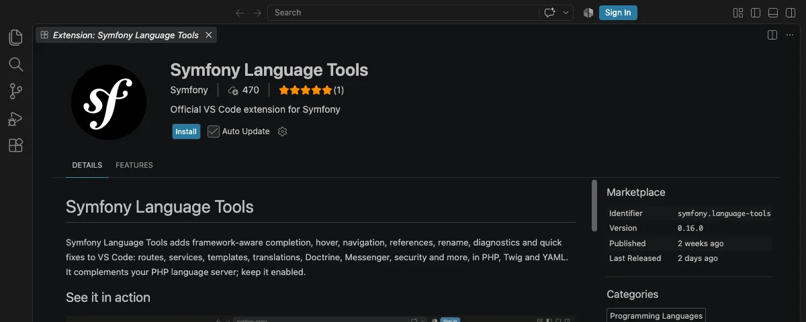

# Symfony Language Tools

Symfony Language Tools adds framework-aware completion, hover, navigation,
references, rename, diagnostics and quick fixes to VS Code: routes, services,
templates, translations, Doctrine, Messenger, security and more, in PHP, Twig
and YAML.
It complements your PHP language server; keep it enabled.

## See it in action



## Get started

1. **Install the extension.** Select **Install** on this page. The package
   includes the language server; nothing else to install or configure.

   

2. **Open a Symfony project.** Open the application root: the folder that
   contains `composer.json` and `bin/console`. No project at hand? Use the
   [Symfony Demo](https://github.com/symfony/demo):

   ```
   git clone https://github.com/symfony/demo.git symfony-demo
   cd symfony-demo/
   composer install
   code .
   ```

   Trust the workspace when VS Code asks. Symfony Language Tools boots the
   kernel of trusted projects to read effective routes, services and other
   metadata; untrusted workspaces get source-only features.

3. **Check the status bar.** Open a PHP file and wait for the lower-left
   status item. **Symfony: dev** with a check mark means source and runtime
   indexes are ready. **Symfony: static** means runtime indexing is
   unavailable, disabled or not trusted. Select the item for details.

4. **Use your usual gestures.** Completion (`Ctrl+Space`), hover,
   Go to Definition (`F12`), Find All References (`Shift+F12`), Rename (`F2`)
   and quick fixes work on route names, service ids, template paths,
   translation keys and every other recognized Symfony value.

   In the Command Palette, type **Symfony Language Tools:** to refresh the
   index, show its status or switch the environment.

## Supported integrations

| Integration | Completion | Hover | Definition | References | Rename | Diagnostics |
| --- | :-: | :-: | :-: | :-: | :-: | :-: |
| Routing | ✓ | ✓ | ✓ | ✓ | ✓ | ✓ |
| Dependency injection | ✓ | ✓ | ✓ | ✓ | ✓ | ✓ |
| Twig template names | ✓ | ✓ | ✓ | ✓ | · | ✓ |
| Translations | ✓ | ✓ | ✓ | ✓ | ✓ | ✓ |
| Environment variables | ✓ | ✓ | ✓ | ✓ | · | ✓ |
| Bundle configuration | ✓ | ✓ | · | · | · | ✓ |
| Messenger | ✓ | ✓ | ✓ | ✓ | · | ✓ |
| Events | ✓ | ✓ | ✓ | ✓ | · | ✓ |
| Security | ✓ | ✓ | ✓ | ✓ | · | ✓ |
| Forms, validation and serializer metadata | ✓ | ✓ | ✓ | ✓ | · | ✓ |
| AssetMapper and importmaps | ✓ | ✓ | ✓ | ✓ | · | ✓ |
| Stimulus and Live Components | ✓ | ✓ | ✓ | ✓ | · | ✓ |
| Doctrine entities and repositories | ✓ | ✓ | ✓ | ✓ | · | · |

A dot marks an intentionally unsupported combination. Document links, quick
fixes and code lenses are covered in the
[feature reference](https://github.com/symfony/language-tools/blob/main/docs/features/index.rst).

## Configuration

The defaults work for standard projects. Add settings to
`.vscode/settings.json` only when your application needs them:

| Setting | When to change it |
| --- | --- |
| `symfonyLsp.phpCommand` | Use `["symfony", "php"]`, a container command or another PHP launcher. |
| `symfonyLsp.consolePath` | The Symfony console is not `bin/console`. |
| `symfonyLsp.environment` | Index another environment than `dev`. |
| `symfonyLsp.runtimeIndexing` | Disable application execution while keeping source-only features. |
| `symfonyLsp.runtimeTimeout` | Maximum time in seconds allowed for the project bridge during runtime indexing. |
| `symfonyLsp.translationDiagnostics` | Enable missing translation-key diagnostics. |
| `php.suggest.basic` | Disable VS Code's word suggestions while keeping your PHP language server. |

## Troubleshooting

- **No Symfony status item.** Open the application root and verify that
  `composer.json` requires `symfony/framework-bundle`.
- **The status stays on Symfony: static.** Trust the workspace, keep debug
  mode enabled and verify that runtime indexing is enabled.
- **Runtime features return no results.** Run `composer install` and make
  sure the configured PHP command can boot `App\Kernel`.
- **The status shows a warning or error.** Select the status item for
  details, then check the **Symfony Language Tools** output channel.
- **Twig has Symfony data but no colors or formatting.** Install a dedicated
  Twig syntax extension; Symfony Language Tools focuses on framework-aware features.
- **Changes are not reflected.** Save the file, then run
  **Symfony Language Tools: Refresh Index**.

## License

The extension is available under the MIT License. Packages include the
applicable third-party notices and license texts.
